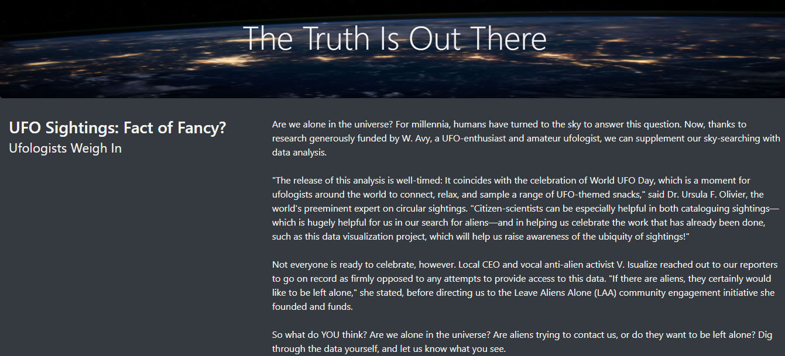

# UFOs sightings with JavaScript 	
**Purpose:**  To use Javascript to build a dynamic table of data and display it online using an HTML file. 

## Overview of the analysis

Javascript will be used to build a table of UFOs sighting information to support a data journalist's news article. The dynamic table of data and the news articles will displayed online to support findings. It will have easy to use filters to finetune the UFOs findings results.  

There is one technical analysis deliverable required to complete   

- Filter UFO sightings on multiple criteria

## Resources
- Data Source: This analysis was performed using the [data.js](https://github.com/aobasuyi/UFOs/blob/main/static/js/data.js) dataset.
- Software: ES6, Javascript;  Visual Studio Code, 1.56

## Results
A more in-depth analysis of UFO sightings is made possible by allowing users filter for multiple criteria at the same time.  
**UFO Sightings News**  
- Users will be presented with the news article and the unfiltered UFO sightings information table. They can scroll down the page to see all UFOs sightings.

    
    

**UFO Sightings - search by date**  
The UFOs table of data is huge. Users therefore, have the option to filter the table using multiple criteria at the same time or they can search using one criterion such as date only (as shown below) 
    

**UFO Sightings - search by date**  
For more in-depth analysis of UFOs sightings, users can filter the table by entering a date, the city of interest, state, and shape. The result below shows the filtered table information based on (Date: 1/1/2010), (State: ca) and (Shape: light).

    

## Summary
- One drawback of this webpage is that the user will neeed to refresh page either using the "enter" button or clicking the page refresh button each time they initiate a new query. 
- Two recommendation for further development include
    - option to further select more than one unique state criterion (e.g state: ca, fl)
    - option to select time range (e.g greater than 1 minute)